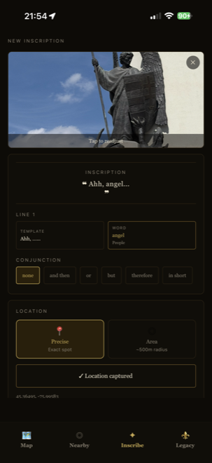
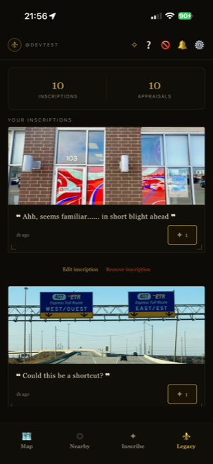
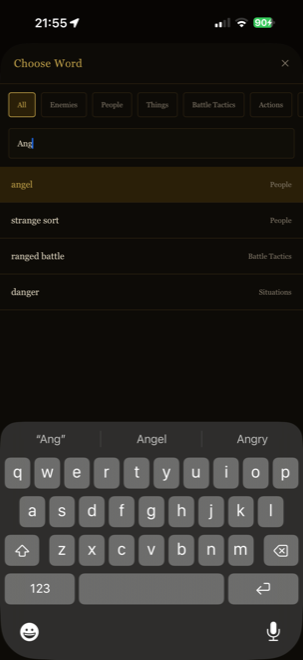
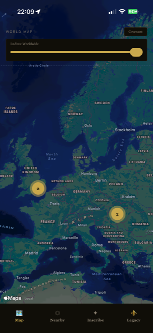
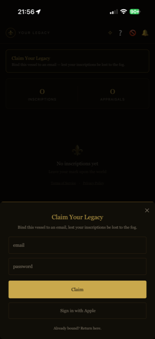
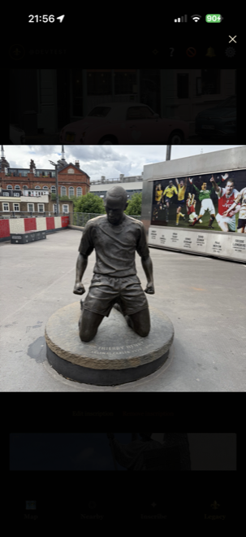

# Sigil

Sigil is an iOS app for leaving short messages at real-world locations. You write something, pin it to wherever you're standing (or blur it out to a wider area if you'd rather not share your exact spot), and it just sits there until a stranger walks close enough to find it.

The idea borrows from the soapstone messages in FromSoftware's action RPGs — leaving something behind for the next person, with no way to know who'll read it or when. I wanted to see what that mechanic feels like mapped onto actual physical space instead of a game world.

  
  
  

## What's actually in it

You can browse a live map or a nearby-feed list of inscriptions other people have left, with nearby pins clustering together and splitting apart as you zoom in. Tap one to see the photo full-screen and "appraise" it if it resonates with you. If you want to be notified when you walk near a new one, there's an opt-in proximity alert — the detection happens entirely on-device through iOS geofencing, so no location data ever leaves your phone for that feature specifically.

  

Accounts are anonymous by default. You can use the whole app without signing up for anything, and claim it later with an email or Sign In with Apple if you want your inscriptions to follow you across devices.

  
  
  

## How it's put together

The client is intentionally thin. It doesn't decide who can see what, how fast someone can post, or where the boundary of an area-mode inscription actually sits — all of that lives in Supabase, enforced by row-level security and a couple of Postgres functions, so the rules hold even if something talks to the API directly instead of going through the app. The one place this shows up most clearly is privacy: when you post to a wide area instead of an exact point, the blur isn't a map overlay hiding a precise coordinate that's sitting in the database somewhere — the imprecise version is the only one that ever gets written. There's nothing to leak later because the real value never existed server-side to begin with.

Reads follow the same "push it into Postgres" instinct. The map and the nearby feed both call a single PostGIS function that does the actual distance filtering, rather than the client pulling everything down and sorting it out locally — which also meant blocking between two users and the per-hour posting limit could live in the same place, as a query filter and a trigger, instead of scattered checks in the app.

Proximity alerts needed the same "don't trust anything you don't have to" thinking applied somewhere I didn't expect: iOS itself. The OS caps you at watching roughly 20 geofences at once, which doesn't work when inscriptions are scattered across the planet, so the app watches whatever's nearest plus one large region around wherever it last checked in. Wander far enough to step outside that outer region and it quietly re-registers the next nearest batch on its own. Everything after that first setup is the OS waking the app up when you cross a boundary — no polling loop, no background timer, nothing keeping the location running when you're not near anything.

## Built with

React Native + Expo (TypeScript), Supabase for the backend (Postgres, PostGIS, Auth, Storage), RevenueCat for the subscription tier.

## Where things stand

Still in development — I'm working through the App Store submission process now.

## Links

- [Privacy Policy](https://tahadeol.github.io/Sigil/privacy.html)
- [Terms of Service](https://tahadeol.github.io/Sigil/terms.html)
- [Support](https://tahadeol.github.io/Sigil/)
